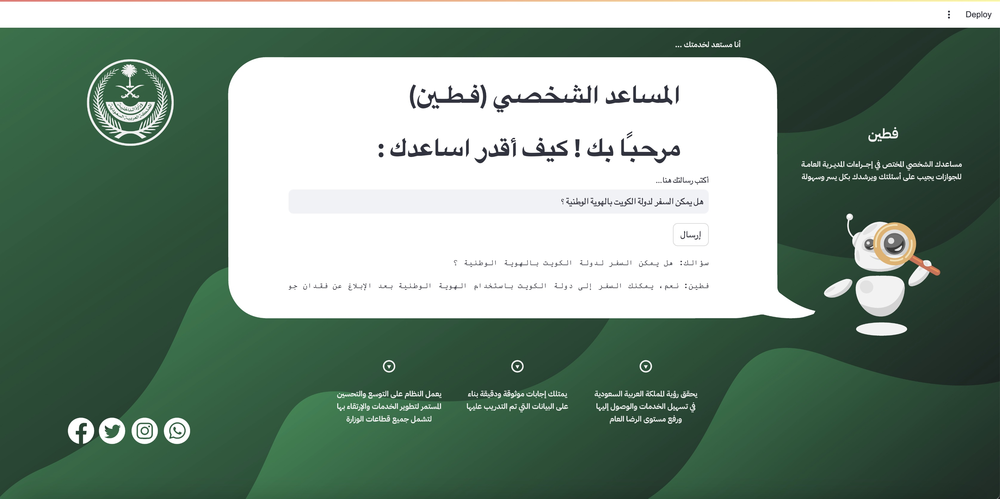

# PersonalAssistant  

[](https://github.com/roshan9419) [](https://github.com/roshan9419) [](https://github.com/roshan9419) [](https://github.com/roshan9419) [](https://github.com/roshan9419) [](https://github.com/roshan9419) [](https://github.com/roshan9419) [](https://github.com/roshan9419)
<br>

*It is an Personal Assistant, capable to perform many tasks with some unique features, that you haven'e seen yet....*  




## The Main Feature:  
1. You can inquire about everything related to the services of the Saudi Ministry of Interior  
2. Math Calculations
 

## Modules Requirements and Installation:  
```sh
pip install altair
pip install numpy
pip install pandas
pip install pydeck
pip install streamlit
pip install langchain_openai
pip install langchain_community
pip install langchain
pip install sentence-transformers
pip install chromadb
pip install pysqlite3-binary 
```
## ***⚠ NOTE: This project is currently supported on Windows OS and Mac OS ***


### To get started run main.py  
```sh
python [main.py](FTeenApp.py)
```

## Math Calculations 
- What is the binary of 142?  
- 2 + 4 - 3 x 9  
- Right shift 4  
- What is the value of factorial 10?  
- What is the value of Sin 90?  
- 9 power 5  
- what is the log of 1000  

## Smart Reply  
- How are you?  
- Who are you?  
- Tell me something  
- When is your birthday?  
- You're so funny  
- Thank You  
- I'm sorry  


(USE PYTHON <= 3.8 WHICH SUPPORTS ALL THE LIBRARIES)
Raise an Issue ticket if you have any other problems  <br><br><br>

## Authors

 **[FTeen]** 🧐 

## License

This project is licensed under the MIT License - see the [LICENSE](LICENSE) file for details
